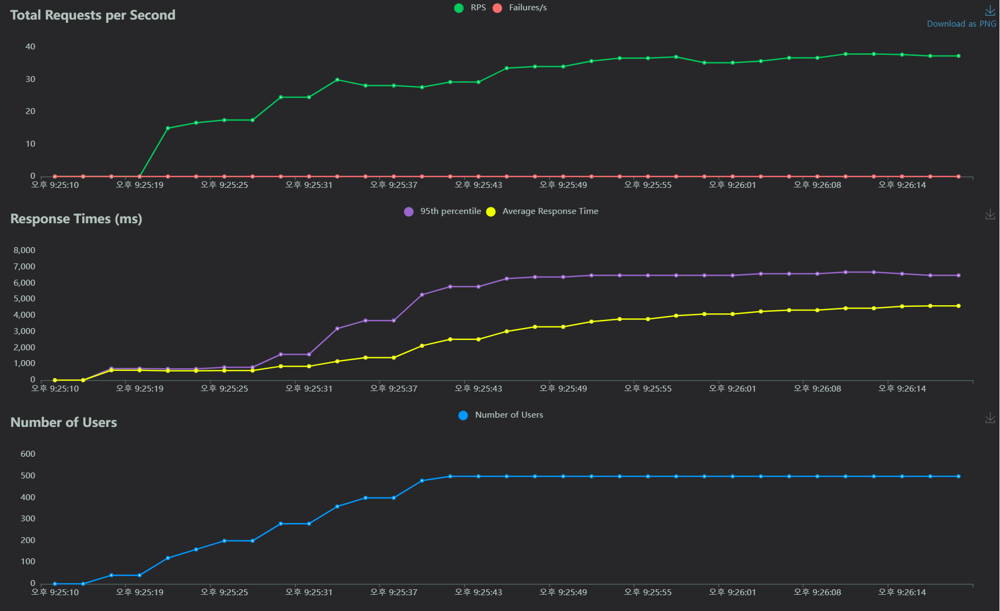
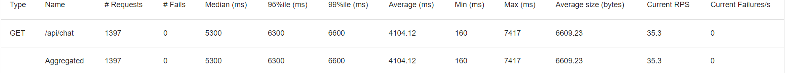
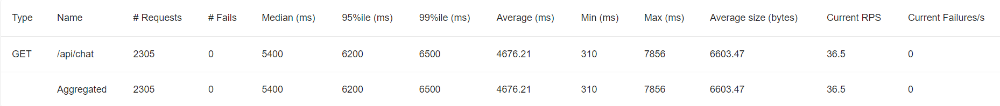
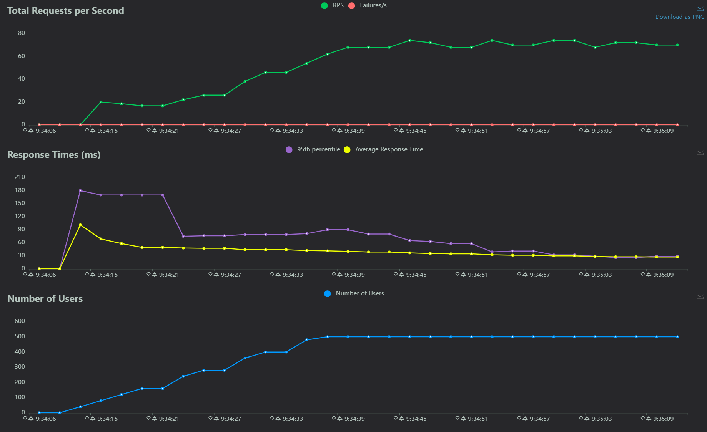
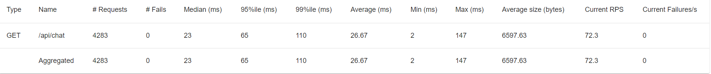
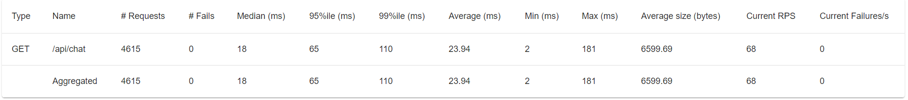

# Redis 도입 전 후 locust로 성능 테스트

  ### 설계
    
  - 텍스트만 주고 받을 수 있다.
  - 메시지 암호화는 현재로써는 필요 없다.
  - 채팅 이력은 보관해야 한다.
  - 사이트를 이용하는 모든 사람은 채팅방 자동 입장

  ### 문제

  - 채팅을 작성할 때마다 DB에 write하게 되면 많은
  - 새로운 사용자가 들어올 때마다 read 작업 수행
  -> 많은 I/O작업으로 리소스 낭비
  
  ### 해결방안

- Redis 전략 중 write back 전략을 통해 write작업 최소화
- Redis에 최신 100개의 채팅을 저장해놓아 mongoDB에서 read할 필요없이 redis에서 가져옴

------------------------------------------------------
  
# 테스트

  - 1초에 20명씩 총 500명까지 사용자 증가
  - 사용자는 BackEnd 서버와 연결 후 최신 메세지 100개를 Read한다.
  - 1초 후 1개의 채팅 다시 3초후 1개의 채팅을 입력한다.
  
## 1. Redis 사용 전
  

  ### 그래프

  

  ### 표

  **1.1 1번째 테스트**
    
  
  
  - 최소 응답 시간 : 160ms
  - 최대 응답 시간 : 7417ms
  - 평균 응답 시간 : 4104.12ms
  - 평균 처리량 : 35.3RPS

  **1.2 2번째 테스트**
    
  
  
  - 최소 응답 시간 : 310ms
  - 최대 응답 시간 : 7856ms
  - 평균 응답 시간 : 4676.21ms
  - 평균 처리량 : 36.5RPS

## 2. Redis 사용 후
  

  ### 그래프

  

  ### 표

  **2.1 1번째 테스트**
    
  
  
  - 최소 응답 시간 : 2ms
  - 최대 응답 시간 : 147ms
  - 평균 응답 시간 : 26.67ms
  - 평균 처리량 : 72.3RPS

  **2.2 2번째 테스트**
    
  
  
  - 최소 응답 시간 : 2ms
  - 최대 응답 시간 : 181ms
  - 평균 응답 시간 : 23.94ms
  - 평균 처리량 : 68RPS
